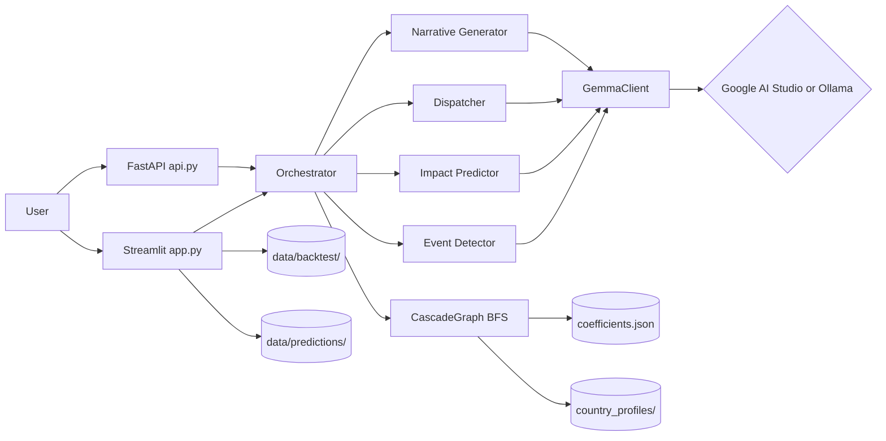

# CascadeAI

> Predicting how a single crisis cascades across interconnected global systems — energy, food, health, and displacement — powered by **Gemma 4**.

CascadeAI takes a humanitarian event (a war, a fertilizer shock, an EV-policy reversal) and walks an 11-node / 18-edge directed dependency graph to forecast which downstream systems will break, by how much, and how soon, for any of 11 country profiles. Gemma 4 supplies natural-language event detection, per-country numeric predictions, stakeholder dispatch plans, and audience-specific narratives in 8+ native languages.

---

## Architecture



The cascade engine in [`cascade/traversal.py`](CascadeAI/cascade/traversal.py) is fully deterministic — Gemma is only used for the natural-language layers around it.

---

## Project layout

```
CascadeAI/
├── README.md
├── LICENSE
├── .env.example
├── .gitignore
└── CascadeAI/
    ├── api.py                      # FastAPI backend
    ├── config.py                   # loads .env
    ├── requirements.txt
    ├── agents/                     # Gemma 4 agents
    │   ├── event_detector.py
    │   ├── impact_predictor.py
    │   ├── dispatcher.py
    │   ├── narrative_generator.py
    │   ├── vision_analyst.py
    │   └── orchestrator.py
    ├── cascade/                    # Deterministic BFS engine
    │   ├── graph.py
    │   ├── traversal.py
    │   ├── replay.py               # Backtest framework
    │   └── data/coefficients.json  # 11 nodes / 18 edges
    ├── data/
    │   ├── country_profiles/       # 11 country JSONs
    │   ├── backtest/               # Historical scenarios
    │   ├── predictions/            # Forward predictions
    │   └── fetchers/               # World Bank / EIA / ACLED / ReliefWeb
    ├── frontend/
    │   ├── app.py                  # Streamlit dashboard
    │   └── components/
    ├── models/
    │   ├── gemma_client.py         # Auto-switches Google ↔ Ollama
    │   └── function_schemas.py
    └── tests/
```

---

## Quickstart

### 1. Install

```bash
git clone <repo-url>
cd CascadeAI

python -m venv .venv
# Windows
.venv\Scripts\activate
# macOS / Linux
source .venv/bin/activate

pip install -r CascadeAI/requirements.txt
```

### 2. Configure environment

Copy the example env file and fill in your Gemma 4 backend.

```bash
cp .env.example CascadeAI/.env
```

Edit `CascadeAI/.env`:

```
GEMMA_API_BASE=https://generativelanguage.googleapis.com/v1beta
GEMMA_API_KEY=your-google-ai-studio-key
GEMMA_MODEL=gemma-4-31b-it
```

Or run locally with Ollama:

```
GEMMA_API_BASE=http://localhost:11434/v1
GEMMA_API_KEY=ollama
GEMMA_MODEL=gemma4:e2b
```

### 3. Run the dashboard

```bash
cd CascadeAI
streamlit run frontend/app.py
```

### 4. (Optional) Run the API

```bash
cd CascadeAI
uvicorn api:app --reload --port 8000
```

Visit `http://localhost:8000/docs` for the OpenAPI explorer.

---

## Dashboard modes

| Mode | What it does |
|---|---|
| **Crisis Simulator** | Pick a crisis node + severity + countries, see the BFS cascade with map, cards, and detail table. |
| **Backtest Validation** | Replay historical crises (Ukraine 2022, Sudan 2023, BEV crash 2025, Hormuz 2026) and compare predictions to actuals. |
| **Live Predictions** | Browse forward-looking scenarios CascadeAI is currently tracking. |
| **Compound Crisis** | Run two simultaneous events on one country with severity combined as `a + b − a·b`. |
| **Event Detector** | Type a free-text crisis description; Gemma 4 classifies it into a graph node + severity, then runs the cascade. |

The **Audience Narratives** tab generates the same event in 6 voices — WHO briefing, field-worker alert, policy brief, media summary, community alert (translated to the local language), and public awareness brief.

---

## Gemma 4 backends

CascadeAI ships with one client ([`models/gemma_client.py`](CascadeAI/models/gemma_client.py)) that auto-detects which API format to use based on the URL.

| Backend | `GEMMA_API_BASE` | `GEMMA_API_KEY` | `GEMMA_MODEL` |
|---|---|---|---|
| **Google AI Studio** (cloud) | `https://generativelanguage.googleapis.com/v1beta` | your API key | e.g. `gemma-4-31b-it` |
| **Ollama** (local / edge) | `http://localhost:11434/v1` | `ollama` | e.g. `gemma4:e2b` |

The client also honors `HTTPS_PROXY` / `HTTP_PROXY` for corporate networks.

---

## Tests

The tests are runnable scripts (no pytest harness yet — see Roadmap):

```bash
cd CascadeAI

python tests/test_p0.py              # Smoke: graph loads, BFS runs, profiles work
python tests/test_predictions.py     # Validates all forward-prediction JSONs
python tests/test_bev_backtest.py    # Replays the BEV 2025 backtest
python tests/test_data_fetchers.py   # Hits World Bank / EIA / ACLED / ReliefWeb (with fallbacks)
python tests/test_api.py             # Live Gemma round-trip — needs GEMMA_API_KEY
python tests/test_full_pipeline.py   # Detector → BFS → Swahili narrative — needs GEMMA_API_KEY
```

`test_api.py` and `test_full_pipeline.py` will skip themselves if `GEMMA_API_KEY` is unset or equal to `ollama`.

---

## Security note

> **A live-looking Google AI Studio key (prefix `AIzaSyBGxomsSzlRz...`) was previously committed to this repo in `tests/test_full_pipeline.py` and `tests/test_api.py`. It has now been removed, but if you ever pulled an earlier copy of those files, treat the key as compromised: revoke and rotate it in the Google AI Studio console.**

`.env` is git-ignored ([`.gitignore`](.gitignore)). Never commit secrets — always use `.env` or your shell environment.

---

## Data sources

The cascade graph and country profiles are grounded in publicly cited sources:

- **IEA** — energy supply & pricing
- **FAO / FPI / IFPRI** — fertilizer, crop yields, food price index
- **World Bank** — GDP, CPI, FX, food prices
- **WHO** — health indicators, malnutrition
- **UNHCR / IOM** — displacement & migration
- **UNICEF / WHO JMP** — water & sanitation
- **IMF WEO** — macroeconomic projections
- **ILO** — employment
- **ACLED** — conflict events
- **ReliefWeb** — humanitarian situation reports
- **EIA** — energy commodity prices

Per-edge attributions are inline in [`cascade/data/coefficients.json`](CascadeAI/cascade/data/coefficients.json).

---

## Roadmap

- pytest harness + GitHub Actions CI
- Edges/arrows on the cascade map between origin region and affected countries
- Live data wiring (currently most fetchers fall back to cached baselines)
- Refactor duplicated `HTTPS_PROXY` reads across fetchers and Gemma client

---

## License

[MIT](LICENSE) — see the LICENSE file. Built for the Gemma 4 challenge.
