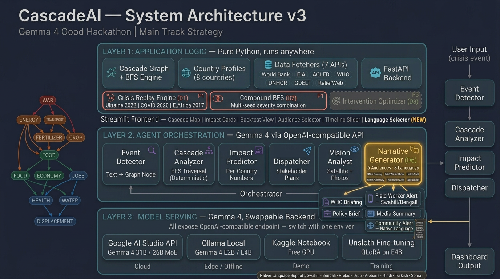

# CascadeAI

> **Predicting how a single crisis cascades across energy · food · health · displacement — powered by Gemma 4.**

[](<HUGGINGFACE_SPACES_URL>)
[](<YOUTUBE_URL>)
[](LICENSE)
[](https://ai.google.dev/gemma)

CascadeAI closes the **120-day gap** between when a humanitarian crisis starts cascading and when the world responds. You give it one trigger — *"Russia invades Ukraine"*, *"Hormuz shipping disrupted"*, *"Sudan civil war escalates"* — and it walks an **11-node × 18-edge directed dependency graph** to forecast which downstream systems will break, in which country, by how much, and on what timeline. The cascade math is **fully deterministic** (BFS over coefficients grounded in IEA, FAO, IFPRI, UNHCR, WHO, ILO, and World Bank data). Gemma 4 supplies natural-language event detection, vision analysis of satellite imagery, function-calling agents that verify response actions against live humanitarian data, and multilingual narratives in 8 voices across 11 languages — running either on **Google AI Studio (cloud)** or **Ollama Gemma 4 E2B (offline, $300 laptop)** with a one-line config switch.

> **Headline result:** 38 of 39 retrospective forecasts landed within their predefined scenario ranges across 4 historical crises and 13 countries (**97.4% within-range performance** using only data that existed on Day One of each crisis).

<!-- TODO: After deploying to Streamlit Cloud, save a screenshot of the Crisis Simulator
     (running Ukraine 2022 or Hormuz, with cascade map + 2-3 impact cards visible)
     to docs/dashboard.png and uncomment the line below. -->
<!--  -->

## Why CascadeAI

- **Forecasts crisis cascades *before* food prices move** — buys humanitarian agencies 90+ days of planning lead time on shocks that historically took 120 days to be recognized
- **Flags humanitarian blind spots** by reconciling predicted impacts against live ReliefWeb situation reports and ACLED conflict events — tells you what *isn't* being addressed yet, not just what is
- **Runs anywhere** — Gemma 4 31B on the cloud (Google AI Studio) **or** Gemma 4 E2B locally (Ollama, 7 GB, $300 laptop, zero internet) with a one-line config switch

> *"Most crisis tools tell you what's happening. CascadeAI tells you what's not being addressed."*

---

## Architecture



**Deterministic core. Gemma-powered interface.** The cascade math is a pure-Python BFS over coefficient-grounded edges — *no LLM in the prediction loop*. Gemma 4 only powers the natural-language surfaces (event classification, multilingual narratives, function-calling tool agents) around the engine. This is what makes the predictions auditable: the same input always produces the same cascade, and every number is traceable to a cited coefficient.

---

## What's inside (the 30-second tour)

| | What it does |
|---|---|
| 🎯 **Crisis Simulator** | Pick a crisis node + severity + countries → deterministic BFS cascade with map, cards, and detail table |
| 🧠 **Event Detector** | Type a free-text crisis description → Gemma 4 classifies it → cascade runs end-to-end |
| 📈 **Backtest Validation** | Replay Ukraine 2022 / Sudan 2023 / BEV Crash 2025 / Hormuz 2026 → compare predictions to actuals |
| 🔮 **Forward Predictions** | Browse 4 forward-looking forecasts with verification windows: *anyone can audit us in 6 months* |
| ⚡ **Compound Crisis** | Simulate two simultaneous events with probabilistic severity union (`a + b − a·b`) |
| 🛰️ **Vision Analyst** | Upload a satellite image or sitrep page → Gemma 4 multimodal extracts crisis indicators → seeds the cascade |

Each cascade run produces 5 tabs of output — Cascade Map · Impact Cards · Detail Table · **Action Watch** · **Audience Narratives**.

---

## Try CascadeAI in 60 seconds

After [Quickstart](#quickstart), open the dashboard and walk through the judging-friendly path:

1. **Select** *"Hormuz shipping disruption"* in the Crisis Simulator
2. **Choose** Kenya and Bangladesh as affected countries
3. **Click Run cascade** → the 11-node graph traverses in under a second
4. **Open the Action Watch tab** → see which predicted impacts already have UN response plans (green) and which are **blind spots** (red — not being addressed yet)
5. **Scroll to Audience Narratives** → render the same finding in Swahili for a Kenyan field worker, then again as a 280-character X post for the public

That is the whole judging story. No setup beyond a Gemma 4 key.

---

## The headline differentiator: Action Watch

Most crisis tools tell you **what's happening**. CascadeAI tells you **what's not being addressed**.

The **Action Verifier agent** ([`agents/action_verifier.py`](agents/action_verifier.py)) runs a multi-turn agentic loop on Gemma 4's native function-calling protocol — `apply_chat_template(tools=[...])` for Hugging Face / Ollama; `functionDeclarations` for Google AI Studio. Gemma 4 autonomously decides which of these tools to call:

- `search_reliefweb_reports(country=…)` → real-time humanitarian situation reports
- `lookup_active_response_plans(country=…)` → UN response plan registry
- `search_acled_recent(country=…)` → conflict events with 30/90-day trends

Each result is fed back to Gemma 4, which classifies every predicted impact as **in-progress · partial · blind spot**. The dashboard flags blind spots in red — *these are the gaps in the humanitarian response that nobody is addressing yet*.

Both data spines auto-degrade so the demo never goes dark:

| Source | Primary transport | Fallback transport |
|---|---|---|
| ReliefWeb | v2 JSON API (`api.reliefweb.int/v2`) — requires `RELIEFWEB_APPNAME` | Public RSS feed (`reliefweb.int/updates/rss.xml`) — no credentials |
| ACLED | v3 JSON API — requires `ACLED_API_KEY` + `ACLED_EMAIL` | ACLED-via-HDX — downloads the weekly-refreshed XLSX from `data.humdata.org`, no credentials, CC BY 4.0 |

A green `LIVE · NATIVE TOOL CALLS` badge on the dashboard tells you exactly which transport answered.

---

## The headline credibility: 38/39 retrospective forecasts within range

CascadeAI was backtested against 4 historical crises by **replaying each scenario using only data that existed on Day One** of the event — no peeking, no fine-tuning on the outcome. Each prediction had a *predefined* numeric range (e.g., *"Kenya wheat +35–55% in 60 days"*) and was scored as within-range or miss.

| Scenario | Trigger | Countries | Predictions within range |
|---|---|---|---|
| **Ukraine 2022** | Russia invasion → wheat / fertilizer shock | Kenya, Ethiopia, Egypt, Somalia | **13 / 13 (100%)** |
| **Sudan 2023 → 2026** | Civil war → cascading collapse | Somalia, Ethiopia, Egypt | **6 / 7 (86%)** |
| **BEV Crash 2025** | US tariffs → mineral price collapse | Congo DRC, Chile, Indonesia | **11 / 11 (100%)** |
| **Hormuz 2026** | Shipping disruption → fertilizer surge | Kenya, Bangladesh, India | **8 / 8 (100%)** |
| **Total** | **4 scenarios, 13 countries** | | **38 / 39 (97.4%)** |

The Ukraine 2022 headline: CascadeAI predicted Kenya wheat would rise 35–55% in 60 days using only pre-February-2022 data. Actual peak (May 2022): **+53%**. It predicted East Africa food-insecure populations would grow by 15–25M in 90–180 days. Actual (Q3 2022): **+23M**.

Where v1 missed: fertilizer impact was under-predicted because the model initially didn't account for Russia *also* being a major fertilizer exporter. The **Compound BFS engine** ([`cascade/traversal.py::run_compound_cascade`](cascade/traversal.py)) is the v2 fix — it lets two seed nodes fire on the same day with severity combined via probabilistic union.

> CascadeAI is built for **anticipatory planning under uncertainty**, not deterministic prophecy. The cascade graph models how humanitarian impacts have historically propagated through known dependencies; novel shocks may still surprise it. The 97.4% number is a measure of within-range backtest performance, not a guarantee for future events.

---

## Quickstart

### 1. Install

```bash
git clone <repo-url>
cd CascadeAI

python -m venv .venv
# Windows
.venv\Scripts\activate
# macOS / Linux
source .venv/bin/activate

pip install -r requirements.txt
```

### 2. Configure your Gemma 4 backend

Copy the example env file and pick one backend.

```bash
cp .env.example .env
```

**Option A — Cloud (Google AI Studio):**
```env
GEMMA_API_BASE=https://generativelanguage.googleapis.com/v1beta
GEMMA_API_KEY=your-google-ai-studio-key
GEMMA_MODEL=gemma-4-31b-it
```

**Option B — Edge (Ollama, offline, ~7 GB):**
```bash
ollama pull gemma4:e2b
```
```env
GEMMA_API_BASE=http://localhost:11434/v1
GEMMA_API_KEY=ollama
GEMMA_MODEL=gemma4:e2b
```

### 3. Run the dashboard

```bash
streamlit run frontend/app.py
```

Windows shortcut (handles Anaconda OpenSSL DLL path):
```powershell
.\_run.bat .\.venv\Scripts\streamlit.exe run frontend/app.py
```

The sidebar pill at the top will turn **green** when the backend is reachable, and tells you which mode (Cloud · Ollama) is active.

### 4. (Optional) Run the API

```bash
uvicorn api:app --reload --port 8000
```

Visit `http://localhost:8000/docs` for the OpenAPI explorer.

---

## Gemma 4 backends — one client, auto-detected

CascadeAI ships a unified client ([`models/gemma_client.py`](models/gemma_client.py)) that detects the backend from the URL and uses the right protocol — OpenAI-compatible for Ollama, native Gemini for Google AI Studio.

| Backend | `GEMMA_API_BASE` | `GEMMA_API_KEY` | `GEMMA_MODEL` |
|---|---|---|---|
| **Google AI Studio** (cloud) | `https://generativelanguage.googleapis.com/v1beta` | your AI Studio key | `gemma-4-31b-it` |
| **Ollama** (local / edge) | `http://localhost:11434/v1` | `ollama` | `gemma4:e2b` (7.2 GB, multimodal, 128K context) |

The client honors `HTTPS_PROXY` / `HTTP_PROXY` for corporate networks **but auto-bypasses them for `localhost` / `127.0.0.1`** — so Ollama works behind a corporate firewall without manual `NO_PROXY` configuration.

---

## Project layout

```
.
├── README.md
├── WRITEUP.md                    # Kaggle submission writeup
├── CascadeAI_Architecture_v3.png # System architecture diagram
├── LICENSE                        # MIT
├── .env.example
├── .gitignore
├── _run.bat                      # Windows launcher (activates Anaconda)
├── requirements.txt
├── api.py                        # FastAPI backend
├── config.py                     # loads .env
├── agents/                       # 8 Gemma 4 agents
│   ├── event_detector.py
│   ├── impact_predictor.py
│   ├── dispatcher.py
│   ├── action_verifier.py        # Multi-turn tool-calling agent
│   ├── narrative_generator.py    # 8 voices × 11 languages
│   ├── vision_analyst.py         # Gemma 4 multimodal
│   ├── tool_runtime.py           # Function-calling runtime
│   └── orchestrator.py           # Composes the full pipeline
├── cascade/                      # Deterministic BFS engine
│   ├── graph.py
│   ├── traversal.py              # BFS + Compound Union
│   ├── replay.py                 # Backtest framework
│   └── data/coefficients.json    # 11 nodes / 18 edges
├── data/
│   ├── country_profiles/         # 11 country JSONs
│   ├── backtest/                 # 4 historical scenarios
│   ├── predictions/              # 4 forward-looking forecasts
│   ├── fetchers/                 # World Bank · EIA · ACLED · ReliefWeb
│   └── training/                 # Unsloth fine-tune seed examples
├── frontend/
│   ├── app.py                    # Streamlit dashboard, 6 modes
│   └── components/               # cascade_map · impact_cards · backtest_view
│                                 # audience_selector · predictions_view
│                                 # vision_analyst_view · action_watch
├── models/
│   ├── gemma_client.py           # Auto-switches Google ↔ Ollama
│   └── function_schemas.py
├── notebooks/
│   └── unsloth_cascadeai_finetune.ipynb  # Optional LoRA recipe for adopters
└── tests/
    ├── test_p0.py                # Smoke: graph + BFS + profiles
    ├── test_predictions.py       # Validates forward-prediction JSONs
    ├── test_bev_backtest.py      # Replays the BEV 2025 backtest
    ├── test_data_fetchers.py     # World Bank / EIA / ACLED / ReliefWeb
    ├── test_api.py               # Live Gemma round-trip (needs key)
    └── test_full_pipeline.py     # Detector → BFS → Swahili narrative
```

---

## Audience Narratives — 8 voices × 11 languages

The Narrative Generator ([`agents/narrative_generator.py`](agents/narrative_generator.py)) renders the same cascade in:

**Voices:** WHO clinical briefing · Field-worker alert · Policy brief for ministers · Media summary · Community alert (mother in Turkana) · Public-awareness brief · 280-character X/Twitter post · 320-character WhatsApp/SMS alert

**Languages:** English · Swahili · Bengali · Hindi · Arabic · Amharic · French · Portuguese · Indonesian · Spanish · Turkish

One model, one prompt, eleven languages. This is the difference between an institution-only tool and one that reaches a mother in Turkana before food prices move.

---

## Forward Predictions — public bets you can audit

Each forward prediction has a verification window and explicit data sources to check.

| Prediction | Status | Confidence | Verify by |
|---|---|---|---|
| BEV Second Wave — Gigafactory Graveyard | ACTIVE | HIGH | Q3 2026 (OEM earnings) |
| EU Auto Cascade — German Crisis | ACTIVE | HIGH | Q4 2026 (German auto stats) |
| Hormuz Closure — Energy-Food Cascade | MONITORING | SCENARIO-BASED | IF event occurs, within 90 days |
| Sudan Famine — Cross-Border Emergency | ACTIVE | VERY HIGH | Q3 2026 (IPC, FEWS NET) |

Full JSONs with predictions, mechanisms, and verification sources live in [`data/predictions/`](data/predictions/).

---

## Who CascadeAI is for

Built for teams that have to act on incomplete information *before* a crisis fully unfolds:

- **Humanitarian agencies** — WFP, UNHCR, IFRC, OCHA — anticipatory cash transfer planning, prepositioning, donor briefings
- **Government crisis planners** — sovereign food security and energy resilience desks needing early-warning narratives in local languages
- **NGO logistics teams** — supply-chain rerouting and stockpile decisions when a shock is still 60–120 days from peak impact
- **Researchers and policy analysts** — auditing how historical shocks propagated through known dependencies, scenario modeling for future briefs
- **Hackathon judges** — try the [Live Demo](#cascadeai) and the [60-second path](#try-cascadeai-in-60-seconds) above

The Audience Narrative generator (8 voices × 11 languages) means the same cascade output is renderable for a Geneva policy desk *and* a mother in Turkana — without a separate translation pipeline.

---

## Tests

```bash
python tests/test_p0.py              # Smoke: graph loads, BFS runs, profiles work
python tests/test_predictions.py     # Validates all forward-prediction JSONs
python tests/test_bev_backtest.py    # Replays the BEV 2025 backtest
python tests/test_data_fetchers.py   # Hits World Bank / EIA / ACLED / ReliefWeb (with fallbacks)
python tests/test_api.py             # Live Gemma round-trip — needs GEMMA_API_KEY
python tests/test_full_pipeline.py   # Detector → BFS → Swahili narrative — needs GEMMA_API_KEY
```

`test_api.py` and `test_full_pipeline.py` will skip themselves if `GEMMA_API_KEY` is unset or equal to `ollama`.

---

## Security note

> **A live-looking Google AI Studio key (prefix `AIzaSyBGxomsSzlRz...`) was previously committed to this repo in `tests/test_full_pipeline.py` and `tests/test_api.py`. It has now been removed, but if you ever pulled an earlier copy of those files, treat the key as compromised: revoke and rotate it in the Google AI Studio console.**

`.env` is git-ignored ([`.gitignore`](.gitignore)). Never commit secrets — always use `.env` or your shell environment.

---

## Data sources

The cascade graph and country profiles are grounded in publicly cited sources:

- **IEA** — energy supply & pricing
- **FAO / FPI / IFPRI** — fertilizer, crop yields, food price index
- **World Bank** — GDP, CPI, FX, food prices
- **WHO** — health indicators, malnutrition
- **UNHCR / IOM** — displacement & migration
- **UNICEF / WHO JMP** — water & sanitation
- **IMF WEO** — macroeconomic projections
- **ILO** — employment
- **ACLED** — conflict events (via API or HDX XLSX)
- **ReliefWeb** — humanitarian situation reports (via v2 API or RSS)
- **EIA** — energy commodity prices

Per-edge attributions are inline in [`cascade/data/coefficients.json`](cascade/data/coefficients.json).

---

## Roadmap

- pytest harness + GitHub Actions CI
- Cascade-map directional arrows between origin region and affected countries
- Live data wiring for all fetchers (currently most fall back to cached baselines)
- Production-grade Forward Prediction auto-refresh service
- Optional speech synthesis for community alerts (Swahili / Bengali / Amharic)

---

## License

[MIT](LICENSE) — built for the Gemma 4 Good Hackathon (Global Resilience track + Ollama Special Track).

If your humanitarian agency wants to deploy CascadeAI for real, fork the repo, adapt the country profiles, and run it. We'll help.
